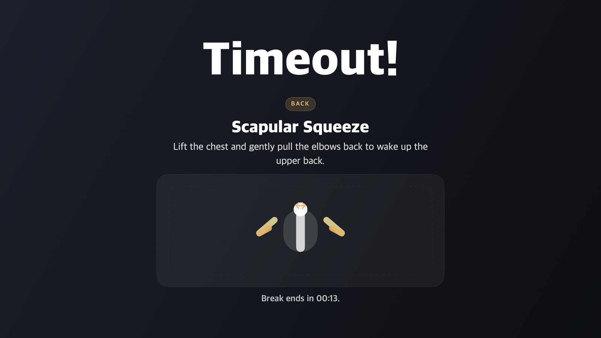

# Timeout!

`Timeout!` is a native macOS menubar app that schedules short movement breaks while you work.



## MVP

- Menubar app with no Dock icon
- Configurable work interval and break duration
- Optional postponement for automatic breaks using camera and microphone activity, with window-title detection as an optional fallback for Google Meet and Slack Huddles
- Fullscreen topmost break overlay that says `Timeout!`
- Timer resets when the screen sleeps or the session becomes inactive
- Launch at login is enabled by default and can be turned off from the menu

## Run from Xcode

Open [Timeout.xcodeproj](/Users/peter.assi/Projects/mentimeter/codex/timeout/Timeout.xcodeproj) in Xcode and run the `Timeout` scheme, or build from the terminal:

```bash
xcodebuild -project Timeout.xcodeproj -scheme Timeout -configuration Debug -derivedDataPath build/DerivedData build
```

The built app bundle lands at `build/DerivedData/Build/Products/Debug/Timeout!.app`.

## Install the Release build

Every push to `main` builds the Release configuration and publishes a GitHub Release with a `Timeout.zip` asset.

1. Open [Releases](https://github.com/peter-assi/Timeout/releases) and download `Timeout.zip` from the latest release.
2. Unzip `Timeout.zip`.
3. Drag `Timeout!.app` into `/Applications`.
4. Open `Timeout!.app` from `/Applications`.
5. If macOS blocks the app because it cannot verify the developer, open System Settings -> Privacy & Security and click `Open Anyway` for `Timeout!`. Confirm the prompt, then open the app again.

`Timeout!` is a menubar app with no Dock icon. After launch, use the timer icon in the macOS menu bar.

To build the Release app locally:

```bash
xcodebuild -project Timeout.xcodeproj -scheme Timeout -configuration Release -derivedDataPath build/DerivedData CODE_SIGNING_ALLOWED=NO build
open "build/DerivedData/Build/Products/Release/Timeout!.app"
```
